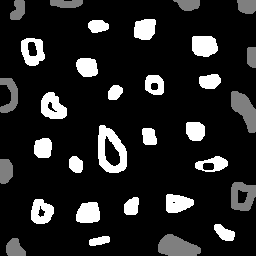

# Exercise 3. Labeling objects 
### Example: Bubbles with holes

In this example, we'll introduce the labeling concept, a method which allow us to identify objects or regions in an image. To create labels, we made use of the `floodfill` OpenCV method, which consists of painting an area that has the same color, replacing it by another color (label). Here this technique is used for labeling and counting white bubbles in a black background,identifing and counting as well, bubbles with holes.

This example was based on the [labeling.cpp](https://agostinhobritojr.github.io/tutorial/pdi/exemplos/labeling.cpp) algorithm and answers to the proposed exercises at [agostinhobritojr.github.io](https://agostinhobritojr.github.io/tutorial/pdi/#_descri%C3%A7%C3%A3o_do_programa_labeling_cpp).

The labeling.cpp algorithm works very well in cases where the amount of objects are below 255 units. But, if we have more than 255 objects to label, varying from the pixel grayscale intesity, we'll find an issue. For theses cases, another approach could be used, for instance, a diferent number representation as such as floating point can be used, so a much greater amount of objects could be labeled.





```cpp
{{ #include ../../../bolhas.cpp }}
```
As a result of the image processing, the output is:
