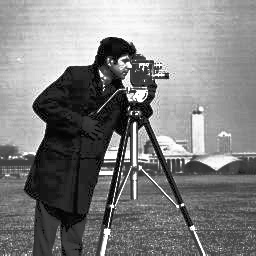
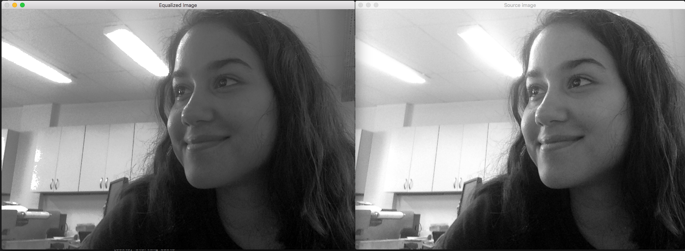

# Exercise 4. Equalizing an image

An image histogram is a graphical representation of the intensity distribution of an image. It quantifies the number of pixels for each intensity value considered. [OpenCV - Histogram equalization](https://docs.opencv.org/2.4/doc/tutorials/imgproc/histograms/histogram_equalization/histogram_equalization.html)
Histogram equalization is a method that improves the contrast in an image, in order to stretch out the intensity range. In this example, in equalize.cpp this outcome has been achived by using OpenCV function:equalize_hist:equalizeHist <>. 




This example was based on the [histogram.cpp](https://agostinhobritojr.github.io/tutorial/pdi/exemplos/histogram.cpp) algorithm and answers to the proposed exercises at [agostinhobritojr.github.io](https://agostinhobritojr.github.io/tutorial/pdi/#_exerc%C3%ADcios_3).

```cpp
{{ #include ../../../equalize.cpp }}
```

### What does this program do? 
```
Create a VideoCapture object
Capture frame-by-frame
Convert the original image to grayscale
Equalize the Histogram by using the OpenCV function EqualizeHist
Display the source and equalized images in a window.
```

As we can see from the output image, the equalized image has a better distribution of the overall contrast, the furniture behind can be easily observed now. Original image is on the rigth and equalized on the left side
