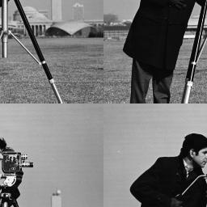

# Exercise 2 - Swapping regions

In this example, we'll create an image by swapping regions from an original one. For this, Regions of Interest (ROI) were created using rectangles with half the height and width of the original image. In sequence, using the `Mat (const Mat &m, const Rect &roi)` constructor, 4 images were created by using those rectangles and finally the `CV::Mat::copyTo(OutPutArray m)` method was used to perfom the swap of the 1-3 and 2-4 regions.





```cpp
{{ #include ../../../troca_regioes.cpp }}
```
