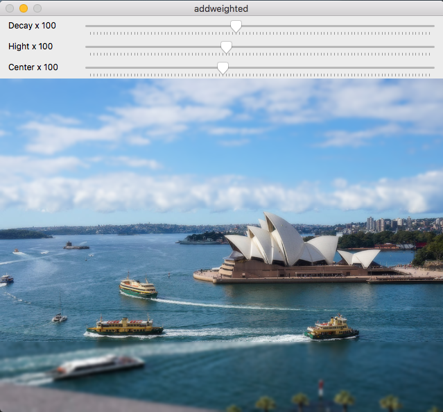

# Exercise 7. Tilty Shift

This example was based in the [addweighted.cpp](https://agostinhobritojr.github.io/tutorial/pdi/exemplos/filtroespacial.cpp) algorithm and answers to the proposed exercises at [agostinhobritojr.github.io](https://agostinhobritojr.github.io/tutorial/pdi/#_exerc%C3%ADcios_6).

This program adds three more functions to the provided example. Through these functions, the tiltyshift.cpp program makes the following adjustments:
1. Adjust the height of the focus centre of the image
2. Adjust the decay of the blurred area
3. Adjust the vertical position of the focus centre area of the filtered image

```cpp
{{ #include ../../../tiltyshift.cpp }}
```
Filtered image

Original image

