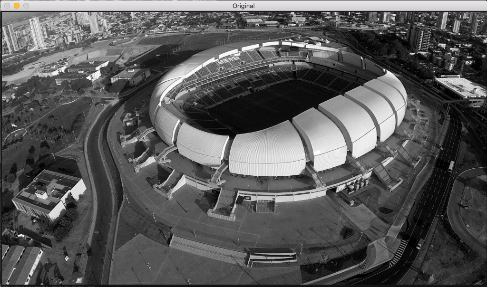
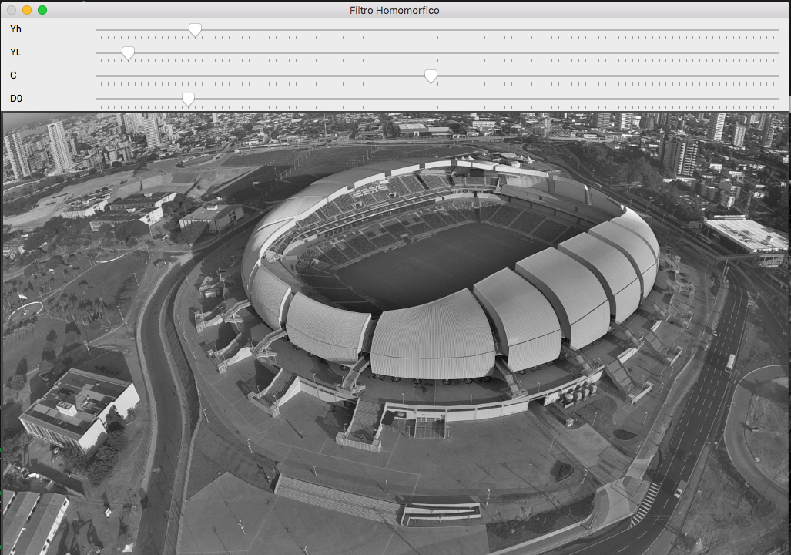

# Exercise 1. Homomorphic filter

This example implements an homomorphic filter based on the [dft.cpp](https://agostinhobritojr.github.io/tutorial/pdi/exemplos/dft.cpp) algorithm and answers to the proposed exercises at [agostinhobritojr.github.io](https://agostinhobritojr.github.io/tutorial/pdi/#_exerc%C3%ADcios_6).

The Homomorphic filter is based on the following function:


## What does this program do?   
#### The program allows 4 different adjustments in the image
1. Regulate the low frequency component γLγL (referring to illumination);
2. Regulate the high frequency component γHγH (referring to reflectance);
3. Regulate the variable C, which controls the slope of the function as it transitions between γLγL and γHγH.
4. Adjust the variable D0D0;

Original image


Filtered image


```cpp
{{ #include ../../../homomorphic.cpp }}
```

git