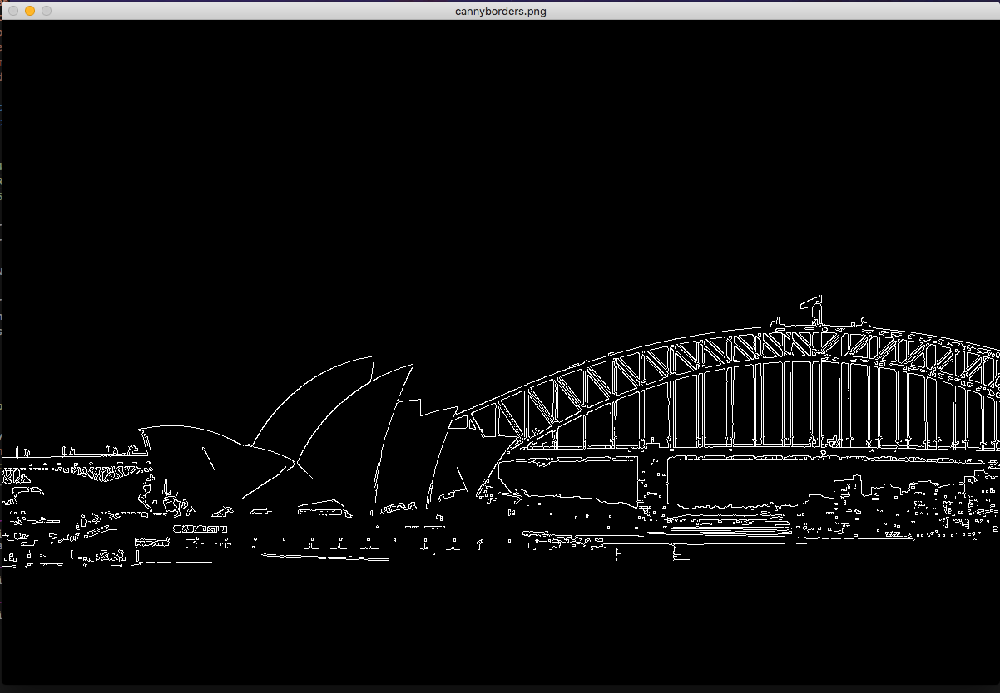
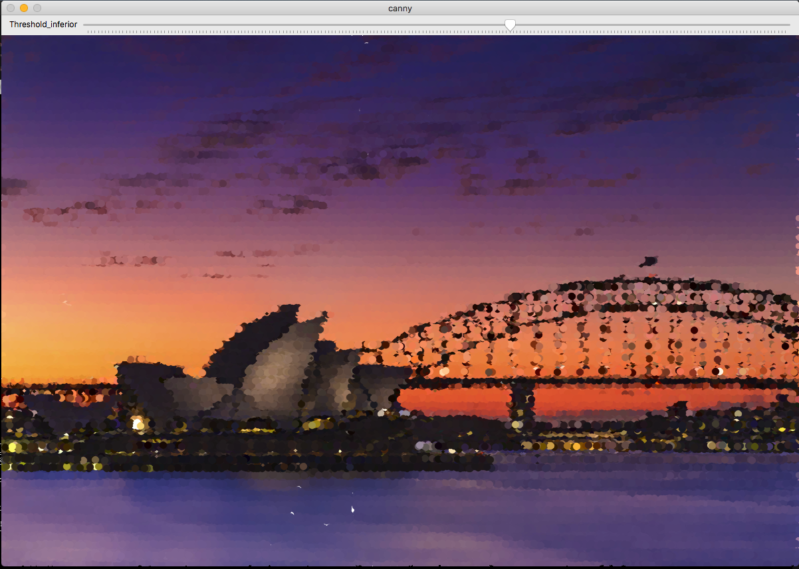

# Exercise 2. Pointillism art

This section uses Canny Edge Detection, developed by John F. Canny in 1986, to create pointillism arts. 
To achieve this goal, we can simulate a painting by drawing circles that work out as a pointillism art. The example below perform the desired effect of pointillism through image processing.

The following steps were used to accomplish this effect:

## What does this program do?   
#### The program allows 4 different adjustments in the image
1. Apply canny algorithm on an image.
2. Use the edges identified by the canny algorithm to draw smaller circles on them;
3. Uses the Canny threshold to increase the quality of the painting affect.

This example was based on the [pointilhismo.cpp](https://agostinhobritojr.github.io/tutorial/pdi/exemplos/pontilhismo.cpp) and [canny.cpp](https://agostinhobritojr.github.io/tutorial/pdi/exemplos/canny.cpp) algorithms and it answers to the proposed exercises at [agostinhobritojr.github.io]https://agostinhobritojr.github.io/tutorial/pdi/#_exerc%C3%ADcios_7).

Original image


Canny edge detector


Filtered image


```cpp
{{ #include ../../../pointillism.cpp }}
```

